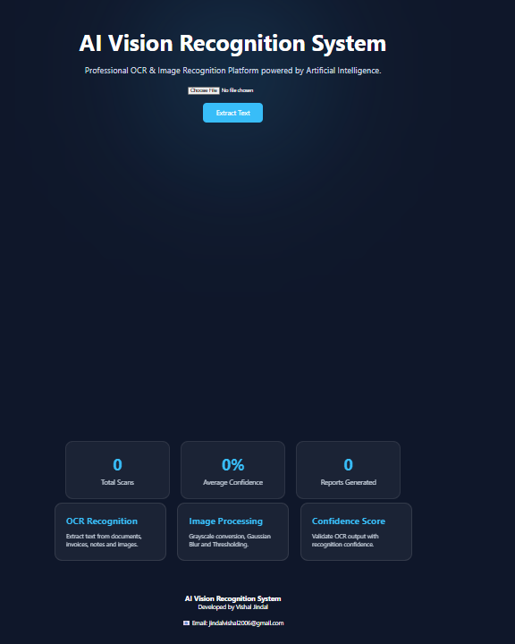

# 👁️ AI Vision Recognition System

Professional OCR & Image Recognition Platform built using Flask, EasyOCR, OpenCV, and SQLite.

## 📌 Overview

AI Vision Recognition System is an OCR-based web application that extracts text from images using Artificial Intelligence and Computer Vision techniques.

The system allows users to upload images, extract text, analyze OCR confidence scores, generate PDF/TXT reports, and maintain scan history through a database.

---

## 🚀 Features

### 🔍 OCR Text Extraction

Extract text from images using EasyOCR.

### 🖼️ Image Processing

Automatic image preprocessing using OpenCV for improved OCR accuracy.

### 📊 Confidence Score

Displays OCR confidence percentage for extracted text.

### 📄 PDF Report Generation

Generate downloadable OCR analysis reports in PDF format.

### 📝 TXT Export

Download extracted text as a TXT file.

### 🗂️ Scan History

Store and manage previous OCR scans using SQLite database.

### 🗑️ Delete History

Delete individual OCR scan records.

### ❌ Clear All History

Remove all stored scan records with a single click.

### 📈 Dashboard Statistics

View:

* Total Scans
* Average Confidence
* Reports Generated

### 🎨 Modern UI

Professional dark-themed user interface.

---

## 🛠️ Technologies Used

### Backend

* Python
* Flask
* SQLite

### AI & Computer Vision

* EasyOCR
* OpenCV
* NumPy

### Frontend

* HTML5
* CSS3
* JavaScript

### Reporting

* ReportLab

---

## 📂 Project Structure

```text
AI_VISION_WEBSITE/
│
├── app.py
├── requirements.txt
├── README.md
│
├── database/
│   └── scans.db
│
├── static/
│   ├── css/
│   │   └── style.css
│   │
│   ├── js/
│   │   └── script.js
│   │
│   ├── uploads/
│   └── exports/
│
└── templates/
    ├── index.html
    ├── result.html
    ├── history.html
    └── about.html
```

---

## ⚙️ Installation

### Clone Repository

```bash
git clone https://github.com/your-username/AI_Vision_Recognition_System.git
cd AI_Vision_Recognition_System
```

### Install Dependencies

```bash
pip install -r requirements.txt
```

### Run Application

```bash
python app.py
```

### Open Browser

```text
http://127.0.0.1:5000
```

---

## 📸 Screenshots

### Home Page



Add screenshot here.

### OCR Result Page

Add screenshot here.

### History Page

Add screenshot here.

### About Page

Add screenshot here.

---

## 📊 OCR Workflow

1. Upload Image
2. Image Preprocessing
3. OCR Text Extraction
4. Confidence Analysis
5. Report Generation
6. History Storage

---

## 🔮 Future Improvements

* Multi-language OCR
* PDF Upload Support
* Drag & Drop Upload
* OCR Analytics Dashboard
* Cloud Storage Integration
* User Authentication

---

## 👨‍💻 Developer

**Vishal Jindal**

AI Vision Recognition System
Professional OCR & Image Recognition Platform

📧 Email: [jindalvishal2006@gmail.com](mailto:jindalvishal2006@gmail.com)

---

## 📄 License

This project is developed for educational and portfolio purposes.